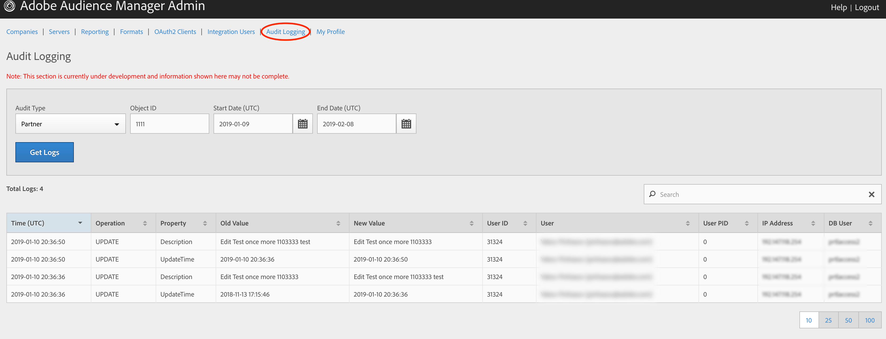

# Prüfprotokollierung {#audit-logging}

Als [!UICONTROL  Audit Logging] Erstes können Sie beim Debugging von Kundenproblemen vorgehen.

> [!NOTE]
>
>[!UICONTROL Audit Logging] befindet sich derzeit in der Entwicklung und unterliegt Änderungen. Bitte melden Sie sich alle Probleme an, die Sie in [!DNL JIRA] ([!DNL UI] Team) aufrufen.

Wählen Sie in der Dropdownliste **Prüftyp** die Option:

* [!UICONTROL Partner]
* [!UICONTROL User]
* [!UICONTROL Group]
* [!UICONTROL Datasource Summary]
* [!UICONTROL General Datasource]
* [!UICONTROL Merge Rule Datasource]
* [!UICONTROL Data Feed]
* [!UICONTROL Data Feed Subscription]
* [!UICONTROL Trait Summary]
* [!UICONTROL Trait Rule]
* [!UICONTROL Segment Summary]
* [!UICONTROL Destination Summary]
* [!UICONTROL Server to Server Destination]
* [!UICONTROL Derived Signal]
* [!UICONTROL Model]
* [!UICONTROL Segment Test Group]

Die **Objekt-ID** ist die ID des Elements, das Sie gerade verwenden. In der folgenden Tabelle finden Sie die ID, die der Objekt-ID in jedem Fall entspricht:

| Prüftyp | Objekt-ID |
---------|----------|
| [!UICONTROL Partner] | Partner-ID - PID |
| [!UICONTROL User] | Benutzer-ID |
| [!UICONTROL Group] | B3 |
| [!UICONTROL Datasource Summary] | Datenquellen-ID |
| [!UICONTROL General Datasource] | Datenquellen-ID |
| [!UICONTROL Merge Rule Datasource] | Datenquellen-ID |
| [!UICONTROL Data Feed] | Datenfeed-ID |
| [!UICONTROL Data Feed Subscription] | Datenfeed-ID |
| [!UICONTROL Trait Summary] | SID (Eigenschaften) |
| [!UICONTROL Trait Rule] | SID (Eigenschaften) |
| [!UICONTROL Segment Summary] |  |
| [!UICONTROL Destination Summary] |  |
| [!UICONTROL Server-to-Server Destination] | Keine |
| [!UICONTROL Derived Signal] | Keine |
| [!UICONTROL Model] | Keine |
| [!UICONTROL Segment Test Group] | Keine |

Mit dem Befehl [!UICONTROL Start Date] ([!DNL UTC]) und [!UICONTROL End Date] ([!DNL UTC]) können Sie das Zeitintervall der Protokolle eingrenzen.