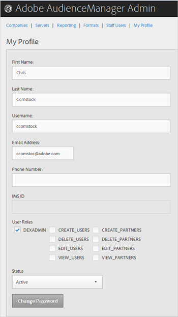
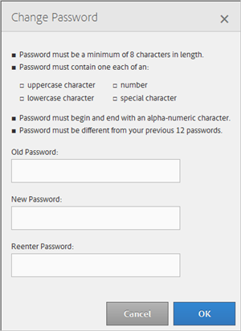

# Mein Profil {#my-profile}

Bearbeiten Sie die Details Ihres Audience Manager Admin Tool-Profils oder ändern Sie Ihr Kennwort.

<!-- c_my_profile.xml -->

## Profil {#edit-profile} bearbeiten

Ansicht und Bearbeitung des Profils des Audience Manager-Admin-Tools, einschließlich Vor- und Nachname, Benutzername, E-Mail-Adresse, Telefonnummer, [!UICONTROL IMS ID], Benutzerrollen und Status.

<!-- t_edit_profile.xml -->

1. Klicken **[!UICONTROL My Profile]**.

   

2. Füllen Sie die Felder aus:
   * **[!UICONTROL First Name]:** (Erforderlich) Geben Sie Ihren Vornamen an.
   * **[!UICONTROL Last Name]:** (Erforderlich) Geben Sie Ihren Nachnamen an.
   * **[!UICONTROL Username]:** (Erforderlich) Geben Sie Ihren ersten Benutzernamen ein.
   * **[!UICONTROL Email Address]:** (Erforderlich) Geben Sie Ihre E-Mail-Adresse ein.
   * **[!UICONTROL Phone Number]:** Geben Sie Ihre Telefonnummer an.
   * **[!UICONTROL IMS ID]:** Geben Sie Ihre ID für den Internetnachrichtendienst an.
   * **[!UICONTROL User Roles]:** Wählen Sie die gewünschten Benutzerrollen aus:
      * **[!UICONTROL DEXADMIN]:** Bietet Administratorzugriff zum Ausführen von Aufgaben im Audience Manager-Admin-Tool. Wenn Sie diese Option nicht auswählen, können Sie einzelne Rollen auswählen. Mit diesen Rollen können Benutzer Aufgaben mithilfe von Aufrufen von [!DNL API] durchführen, jedoch nicht im Admin-Tool.
      * **[!UICONTROL CREATE_USERS]:** Ermöglicht Benutzern das Erstellen neuer Benutzer mithilfe eines  [!DNL API] Anrufs.
      * **[!UICONTROL DELETE_USERS]:** Ermöglicht Benutzern das Löschen vorhandener Benutzer mithilfe eines  [!DNL API] Aufrufs.
      * **[!UICONTROL EDIT_USERS]:** Ermöglicht Benutzern die Bearbeitung vorhandener Benutzer mithilfe eines  [!DNL API] Aufrufs.
      * **[!UICONTROL VIEW_USERS]:** Ermöglicht Benutzern die Ansicht anderer Benutzer in Ihrer Audience Manager-Konfiguration mithilfe eines  [!DNL API] Aufrufs.
      * **[!UICONTROL CREATE_PARTNERS]:** Ermöglicht Benutzern das Erstellen von Audience Manager-Partnern mithilfe eines  [!DNL API] Anrufs.
      * **[!UICONTROL DELETE_PARTNERS]:** Ermöglicht Benutzern das Löschen von Audience Manager-Partnern mithilfe eines  [!DNL API] Aufrufs.
      * **[!UICONTROL EDIT_PARTNERS]:** Ermöglicht Benutzern, Audience Manager-Partner mithilfe eines  [!DNL API] Anrufs zu bearbeiten.
      * **[!UICONTROL VIEW_PARNTERS]:** Ermöglicht Benutzern, Ansicht Audience Manager-Partnern einen  [!DNL API] Aufruf zu senden.
   * **[!UICONTROL Status]:** Wählen Sie den gewünschten Status aus:
      * **[!UICONTROL Active]:** Gibt an, dass dieser Benutzer in einem aktiven Audience Manager verwendet wird.
      * **[!UICONTROL Deactivated]:** Gibt an, dass dieser Benutzer in der Audience-Verwaltung deaktiviert ist.
      * **[!UICONTROL Expired]:** Gibt an, dass das Benutzerkonto in Audience Manager abgelaufen ist.
      * **[!UICONTROL Locked Out]:** Gibt an, dass das Benutzerkonto in Audience Manager gesperrt ist.
3. Klicken **[!UICONTROL Submit]**.

## Kennwort ändern {#change-password}

Ändern Sie das Kennwort für das Admin-Tool des Audience Managers.

<!-- t_change_password.xml -->

1. Klicken **[!UICONTROL My Profile]**.
1. Klicken **[!UICONTROL Change Password]**.

   

   Ihr Audience Manager-Kennwort muss wie folgt lauten:

   * mindestens acht Zeichen lang;
   * enthält mindestens ein Großbuchstabe;
   * enthält mindestens ein Kleinbuchstabe;
   * muss mindestens eine Zahl enthalten;
   * enthält mindestens ein Sonderzeichen;
   * Beginn und Ende mit einem alphanumerischen Zeichen;
   * Beginnen und enden Sie mit einem alphanumerischen Zeichen.

1. Geben Sie Ihr altes Kennwort ein.
1. Geben Sie Ihr neues Kennwort ein und bestätigen Sie dann das neue Kennwort.
1. Klicken **[!UICONTROL OK]**.