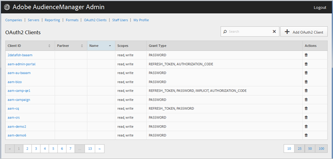

# OAuth2-Clients {#oauth-clients}

Verwenden Sie die [!UICONTROL OAuth2 Clients] Seite, um eine Liste von [!UICONTROL OAuth2] Clients in Ihrer [!DNL Audience Manager] Konfiguration Ansicht. Sie können vorhandene Clients bearbeiten oder löschen oder neue Clients erstellen, sofern Ihnen die entsprechenden Benutzerrollen zugewiesen sind.

## Überblick {#overview}

<!-- c_oauth.xml -->

>[!NOTE]
>
>Vergewissern Sie sich, dass Ihr Kunde die [OAuth2](https://docs.adobe.com/content/help/en/audience-manager/user-guide/api-and-sdk-code/rest-apis/aam-api-getting-started.html#oauth) -Dokumentation im Audience Manager-Benutzerhandbuch liest.

[!DNL OAuth2] ist ein offener Standard für die Autorisierung, um einen gesicherten delegierten Zugriff auf [!DNL Audience Manager] Ressourcen für einen Ressourcenbesitzer zu ermöglichen.

Sie können jede Spalte in auf- oder absteigender Reihenfolge sortieren, indem Sie auf die Kopfzeile der gewünschten Spalte klicken.

Verwenden Sie das [!UICONTROL Search] Feld oder die Paginierungssteuerelemente am unteren Rand der Liste, um den gewünschten Client zu finden.

## OAuth2-Client erstellen oder bearbeiten {#create-edit-client}

<!-- t_create_edit_auth.xml -->

Verwenden Sie die [!UICONTROL OAuth2 Clients] Seite im Audience Manager- [!UICONTROL Admin] Tool, um einen neuen [!UICONTROL Oauth2] Client zu erstellen oder einen vorhandenen Client zu bearbeiten.

1. Um einen neuen [!UICONTROL OAuth2] Client zu erstellen, klicken Sie auf **[!UICONTROL OAuth2 Clients]** > **[!UICONTROL Add OAuth2 Client]**. Um einen vorhandenen [!UICONTROL OAuth2] Client zu bearbeiten, klicken Sie auf den gewünschten Client in der **[!UICONTROL Client ID]** Spalte.
1. Geben Sie den gewünschten Namen für diesen [!UICONTROL OAuth2] Client an. Beachten Sie, dass dies nur ein Name für den Datensatz ist.
1. Geben Sie die E-Mail-Adresse des [!UICONTROL OAuth2] Kunden an. Es gibt eine Grenze von einer E-Mail-Adresse.
1. Wählen Sie in der **[!UICONTROL Partner]** Dropdown-Liste den gewünschten Partner aus.
1. Geben Sie im **[!UICONTROL Client ID]** Feld die gewünschte ID ein. Dies ist der Wert, der beim Senden von [!DNL API] Anforderungen verwendet wird. Das Präfix wird automatisch ausgefüllt, wenn Sie nach Auswahl eines [!UICONTROL Partner] aus der Dropdown-Liste im vorherigen Schritt einen Beginn eingeben. Das richtige Format ist &lt; *`partner subdomain`*> - &lt; *`Audience Manager username`*>.
1. Aktivieren bzw. deaktivieren Sie das **[!UICONTROL Restrict to Partner Users]** Kontrollkästchen nach Bedarf. Wenn dieses Kontrollkästchen aktiviert ist, muss es sich bei dem Benutzer um einen für den ausgewählten Partner aufgelisteten [!DNL Audience Manager] Benutzer handeln. Es empfiehlt sich daher, diese Option zu wählen.
1. Aktivieren bzw. deaktivieren Sie im **[!UICONTROL Scope]** Abschnitt die Kontrollkästchen **[!UICONTROL Read]** und **[!UICONTROL Write]** .
1. Wählen Sie im **[!UICONTROL Grant Type]** Abschnitt die gewünschten Autorisierungsmöglichkeiten aus. Es wird empfohlen, die Standardeinstellungen [!UICONTROL Password] und - [!UICONTROL Refresh-token] optionen zu verwenden.

   * **[!UICONTROL Implicit]**: Wenn Sie diese Option auswählen, ist das [!UICONTROL Redirect URI] Feld aktiviert. Der Benutzer erhält nach der Authentifizierung ein automatisches Zugriffstoken und wird sofort an die Umleitung gesendet [!DNL URI].
   * **[!UICONTROL Authorization Code]**: Wenn Sie diese Option auswählen, ist das [!UICONTROL Redirect URI] Feld aktiviert. Der Benutzer wird nach der Authentifizierung an den Client zurückgegeben und dann an die Weiterleitung gesendet [!DNL URI].
   * **[!UICONTROL Password]**: Der Benutzer wird mit einem vom Benutzer eingegebenen Kennwort authentifiziert und nicht mit einem Autorisierungsserver.
   * **[!UICONTROL Refresh_token]**: Dient zum Aktualisieren eines abgelaufenen Zugriffstokens über einen längeren Zeitraum.

1. Geben Sie im **[!UICONTROL Redirect URI]** Feld den gewünschten Wert ein [!DNL URI]. Diese Option ist nur aktiviert, wenn Sie die **[!UICONTROL Implicit]** und die **[!UICONTROL Authorization_code]** Zuschussarten auswählen. Im **[!UICONTROL Redirect URI]** Feld können Sie einen kommagetrennten Wert akzeptabler [!DNL URI] Werte angeben. Dies ist der [!DNL URI] Benutzer eines Clients, zu dem umgeleitet wird, nachdem der Client für den [!DNL API] Zugriff genehmigt wurde.
1. Geben Sie die gewünschte Ablaufzeit (in Sekunden) für den Zugriff und den Ablauf des Aktualisierungstokens an.

   * **[!UICONTROL Access Token Expiration Time]**: Die Anzahl der Sekunden, die ein Zugriffstoken nach der Ausstellung gültig ist. Kann null sein, um den Plattformstandard zu verwenden (12 Stunden). Auch kann -1 sein, um anzugeben, dass das Zugriffstoken nicht abläuft.
   * **[!UICONTROL Refresh Token Expiration Time]**: Die Anzahl der Sekunden, die ein Aktualisierungstoken nach der Ausgabe gültig ist. Kann null sein, um den Plattformstandard zu verwenden (30 Tage).

1. Klicken **[!UICONTROL Save]**.

Um einen [!UICONTROL OAuth2] Client zu löschen, klicken Sie auf **[!UICONTROL OAuth2 Clients]** und dann auf  die **[!UICONTROL Actions]** Spalte für den gewünschten Client.

>[!MORELIKETHIS]
>
>* [API-Anforderungen und -Empfehlungen](../admin-oauth2/aam-admin-api-requirements.md)

