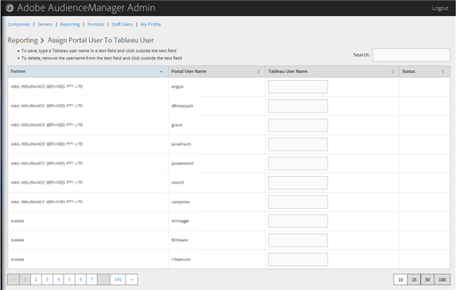

# Assign a Portal User to a Tableau User {#assign-a-portal-user-to-tableau-user}

<!-- t_tabeau.xml -->

Verwenden Sie die [!UICONTROL Reporting] Seite, um einen Portalbenutzer zu einem [!DNL Tableau] Benutzer zu machen. Auf diese Weise können Benutzer [!DNL Tableau] Berichte in Audience Manager Ansicht haben.

1. Klicken **[!UICONTROL Reporting]** > **[!UICONTROL Assign Portal User to Tableau User]**.

   

1. Um einen Benutzer zuzuweisen, geben Sie in der gewünschten Partnerzeile einen [!DNL Tableau] Benutzernamen in das Textfeld ein und klicken Sie dann außerhalb des Textfelds.

Um eine Benutzerzuweisung zu löschen, entfernen Sie in der gewünschten Partnerzeile den Benutzernamen aus dem Textfeld und klicken Sie dann auf außerhalb des Textfelds.
