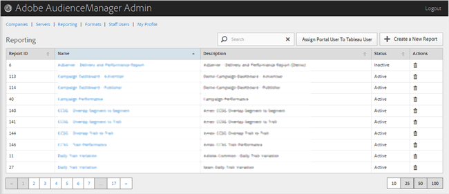

# Berichterstellung {#reporting}

Verwalten Sie Audience Manager-Berichte, indem Sie neue Berichte erstellen oder bestehende Berichte bearbeiten oder löschen. Sie können einen Portal-Benutzer auch als [!DNL Tableau] Benutzer zuweisen.

<!-- c_reporting.xml -->

Sie können jede Spalte in auf- oder absteigender Reihenfolge sortieren, indem Sie auf die Kopfzeile der gewünschten Spalte klicken.

Verwenden Sie das Feld [!UICONTROL Search] oder die Paginierungssteuerelemente am unteren Rand der Liste, um den gewünschten Bericht zu finden.
