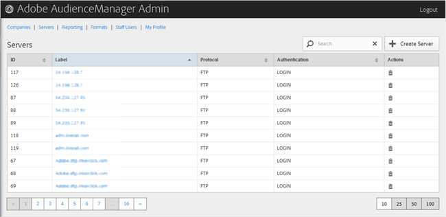

# Löschen von Servern {#delete-a-server}

Verwenden Sie die [!UICONTROL Servers] Seite im Audience Manager-Admin-Tool, um einen vorhandenen Server zu löschen.

<!-- t_delete_server.xml -->

>[!NOTE]
>
>Sie müssen die [!UICONTROL DEXADMIN] Rolle haben, um vorhandene Server zu löschen.

1. Um einen vorhandenen Server zu löschen, klicken Sie auf **[!UICONTROL Servers]**.

   

1. Klicken Sie  in die **[!UICONTROL Actions]** Spalte des gewünschten Servers.
1. Klicken Sie auf **[!UICONTROL OK]**, um den Löschvorgang zu bestätigen.
