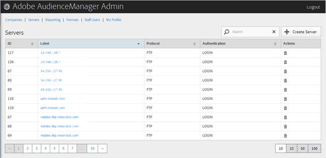

# Serverübersicht {#servers-overview}

Verwenden Sie die [!UICONTROL Servers] Seite, um eine Liste der Server in Ihrer Audience Manager-Konfiguration anzuzeigen. Sie können vorhandene Server bearbeiten oder löschen oder neue Server erstellen, sofern Ihnen die entsprechenden Benutzerrollen zugewiesen sind.

<!-- c_servers.xml -->

Sie können jede Spalte in auf- oder absteigender Reihenfolge sortieren, indem Sie auf die Kopfzeile der gewünschten Spalte klicken. Verwenden Sie das [!UICONTROL Search] Feld oder die Paginierungssteuerelemente unten in der Liste, um den gewünschten Server zu finden.