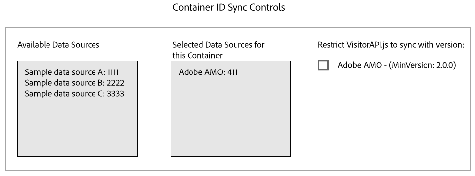

# ID-Synchronisierung mit Media Optimizer {#id-syncing-with-media-optimizer}

Standardmäßig synchronisieren alle Unternehmen Daten mit [!DNL Adobe Media Optimizer] ([!DNL AMO]). In der [!UICONTROL Admin UI]Liste enthält jeder Unternehmenscontainer eine Datenquelle, die diesen Prozess verwaltet. Diese Datenquelle ist [!UICONTROL Adobe AMO] ([!UICONTROL ID] 411). Klicken Sie auf eine Containerzeile (unter der [!UICONTROL Containers] Registerkarte) für ein ausgewähltes Unternehmen, um diese Standardsynchronisierung zu deaktivieren oder andere Datenquellen zum [!DNL AMO] Synchronisierungsprozess hinzuzufügen und zu entfernen.

## ID-Synchronisierungsstatus {#id-sync-status}

Die folgende Tabelle beschreibt den Synchronisierungsstatus einer Datenquelle.

| Status | Beschreibung |
|------ | -------- |
| Aus | Entfernen Sie alle Datenquellen [!UICONTROL Selected Data Sources] für diesen Behälter, um die ID-Synchronisierung mit [!DNL AMO] |
| On (unabhängig von der ID-Dienstversion) | Eine Datenquelle synchronisiert [!DNL AMO] unabhängig von der ID-Dienstversion, wenn: <ul><li>Die Datenquelle wird in der [!UICONTROL Selected Data Sources] Liste angezeigt.</li><li>Das [!DNL AMO] Kontrollkästchen *ist nicht* aktiviert.</li></ul> |
| On (unabhängig von der ID-Dienstversion) | Eine Datenquelle wird mit [!DNL AMO] dem ID-Dienst Version 2.0 (oder höher) synchronisiert, wenn: <ul><li>Die Datenquelle wird in der [!UICONTROL Selected Data Sources] Liste angezeigt.</li><li>Das [!DNL AMO] Kontrollkästchen *ist* aktiviert.</li></ul> |

>[!MORE_LIKE_THIS]
>
>* [Behälter verwalten](../companies/admin-manage-containers.md#task_61DB5CEECC5049DD8D059C642AC3F967)

