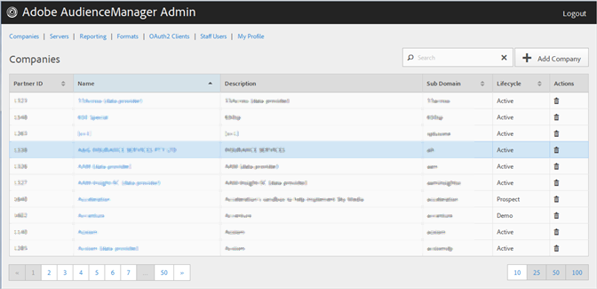

# Unternehmen {#companies}

Auf der [!UICONTROL Companies] Seite können Sie eine Liste der Unternehmen in Ihrer Audience Manager-Konfiguration anzeigen. Sie können bestehende Unternehmen bearbeiten oder löschen oder neue Unternehmen erstellen, sofern Ihnen die entsprechenden Benutzerrollen zugewiesen sind.

Sie können jede Spalte in auf- oder absteigender Reihenfolge sortieren, indem Sie auf die Kopfzeile der gewünschten Spalte klicken.

Verwenden Sie das [!UICONTROL Search] Feld oder die Paginierungssteuerelemente unten in der Liste, um das gewünschte Unternehmen zu finden.
