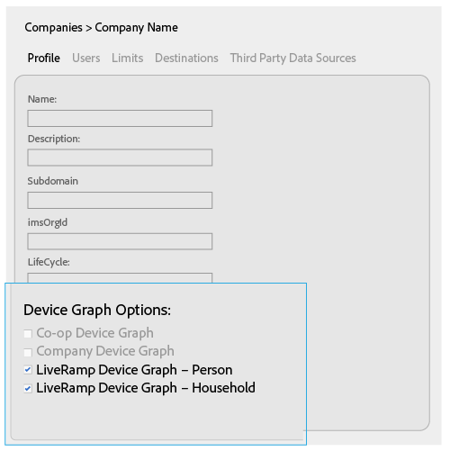
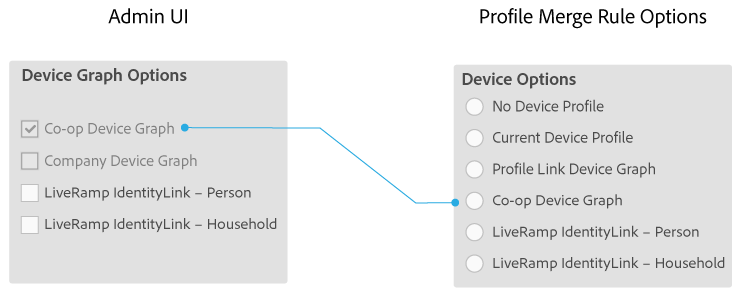
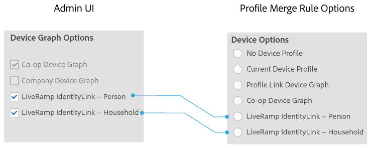

# Gerätediagrammoptionen für Firmen {#device-graph-options-for-companies}

Die [!UICONTROL Device Graph Options] stehen Firmen zur Verfügung, die an der teilnehmen [!DNL Adobe Experience Cloud Device Co-op]. Wenn ein Kunde auch eine Vertragsbeziehung mit einem in Audience Manager integrierten Drittanbieter für Gerätediagramme unterhält, werden in diesem Abschnitt Optionen für dieses Gerätediagramm angezeigt. Diese Optionen befinden sich unter [!UICONTROL Companies] > Firma > [!UICONTROL Profile] > [!UICONTROL Device Graph Options].

In dieser Abbildung werden allgemeine Namen für die Diagrammoptionen von Drittanbietern verwendet. In der Produktion kommen diese Namen vom Gerätegrafferanbieter und können von dem hier abweichen. Die [!DNL LiveRamp] Optionen zum Beispiel (aber nicht immer):

* Mit &quot;[!DNL LiveRamp]&quot;
* Enthält einen Vornamen, der variiert
* Mit &quot;[!UICONTROL - Household]&quot;oder &quot;[!UICONTROL -Person]&quot; beenden

## Gerätediagrammoptionen definiert {#device-graph-options-defined}

Die hier gewählten Gerätediagrammoptionen stellen die [!UICONTROL Device Options] Auswahlmöglichkeiten für einen [!DNL Audience Manager] Kunden offen, wenn er einen [!UICONTROL Profile Merge Rule]erstellt.

### Co-op-Gerätediagramm {#co-op-graph}

Kunden, die am [Adobe Experience Cloud Device Co-op](https://marketing.adobe.com/resources/help/en_US/mcdc/) teilnehmen, verwenden diese Optionen, um eine [!UICONTROL Profile Merge Rule] mit [deterministischen und wahrscheinlichen Daten](https://marketing.adobe.com/resources/help/en_US/mcdc/mcdc-links.html)zu erstellen. Diese Option [!DNL Corporate Provisioning Team] wird über einen Back-End- [!DNL API] Aufruf aktiviert und deaktiviert. Sie können diese Kästchen im [!DNL Admin UI]Feld weder markieren noch löschen. Außerdem schließen sich die Optionen **[!UICONTROL Co-op Device Graph]** und **[!UICONTROL Company Device Graph]** Optionen gegenseitig aus. Kunden können uns bitten, das eine oder andere zu aktivieren, aber nicht beides. Wenn diese Option aktiviert ist, wird das **[!UICONTROL Co-op Device Graph]** Steuerelement in den [!UICONTROL Device Options] Einstellungen für ein [!UICONTROL Profile Merge Rule]Steuerelement verfügbar gemacht.

### Gerätediagramm der Firma {#company-graph}

Diese Option ist für [!DNL Analytics] Kunden gedacht, die die [!UICONTROL People] Metrik in ihrer [!DNL Analytics] Report Suite verwenden. Diese Option [!DNL Corporate Provisioning Team] wird über einen Back-End- [!DNL API] Aufruf aktiviert und deaktiviert. Sie können diese Kästchen im [!DNL Admin UI]Feld weder markieren noch löschen. Außerdem schließen sich die Optionen **[!UICONTROL Company Device Graph]** und **[!UICONTROL Co-op Device Graph]** Optionen gegenseitig aus. Kunden können uns bitten, das eine oder andere zu aktivieren, aber nicht beides. Wenn aktiviert:

* Dieses Gerätediagramm verwendet deterministische Daten, die zur konfigurierten Firma gehören (keine probabilistischen Daten).
* [!DNL Audience Manager] erstellt automatisch einen [!UICONTROL Data Source] so genannten `*`Partnernamen`*-Company Device Graph-Person`. Auf der [!UICONTROL Data Source] Detailseite können [!DNL Audience Manager] Kunden den Namen und die Beschreibung des Partners ändern und [Datenexportkontrollen](https://marketing.adobe.com/resources/help/en_US/aam/c_dec.html) auf diese Datenquelle anwenden.
* [!DNL Audience Manager] Kunden *sehen keine* neue Einstellung im [!UICONTROL Device Options] Abschnitt für eine [!UICONTROL Profile Merge Rule].

### LiveRamp-Gerätediagramm (Person oder Haushalt) {#liveramp-device-graph}

Diese Kontrollkästchen sind in der aktiviert, [!DNL Admin UI] wenn ein Partner eine [!UICONTROL Data Source] und auswählt **[!UICONTROL Use as an Authenticated Profile]** und/oder **[!UICONTROL Use as a Device Graph]**. Die Namen für diese Einstellungen werden vom Diagrammanbieter des Drittanbieters (z. B. [!DNL LiveRamp], [!DNL TapAd]usw.) bestimmt. Wenn diese Option aktiviert ist, bedeutet dies, dass die Firma, die Sie konfigurieren, die von diesen Gerätediagrammen bereitgestellten Daten verwendet.

>[!MORELIKETHIS]
>
>* [Für Profilzusammenführungsrichtlinien definierte Optionen](https://marketing.adobe.com/resources/help/en_US/aam/merge-rule-definitions.html)
>* [Datenquelleneinstellungen und Menüoptionen](https://marketing.adobe.com/resources/help/en_US/aam/datasource-settings-definitions.html)

