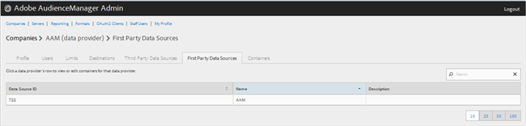
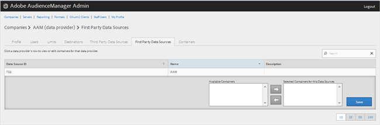

# Erstanbieter-Datenanbieter verwalten {#manage-first-party-data-providers}

Anzeigen oder Bearbeiten von Behältern und Zuordnungen für Erstanbieter-Datenanbieter.

<!-- t_first_party_providers.xml -->

1. Klicken Sie auf **[!UICONTROL Companies]**, suchen Sie das gewünschte Unternehmen und klicken Sie darauf, um die zugehörige [!UICONTROL Profile] Seite anzuzeigen. Verwenden Sie das [!UICONTROL Search] Feld oder die Paginierungssteuerelemente unten in der Liste, um das gewünschte Unternehmen zu finden. Sie können jede Spalte in auf- oder absteigender Reihenfolge sortieren, indem Sie auf die Kopfzeile der gewünschten Spalte klicken.

1. Click the **[!UICONTROL First Party Data Providers]** tab.

   

1. Klicken Sie auf die Zeile eines Datenanbieters, um Behälter und Zuordnungen für diesen Datenanbieter anzuzeigen oder zu bearbeiten.

   

1. Verschieben Sie Behälter aus den Listen **[!UICONTROL Available Containers]** und **[!UICONTROL Selected Containers for This Data Provider]** durch Auswahl der gewünschten Behälter und klicken Sie dann nach Bedarf auf den Rechts- oder Linkspfeil.
1. Klicken Sie auf **[!UICONTROL Save]** , wenn Sie Änderungen vorgenommen haben.