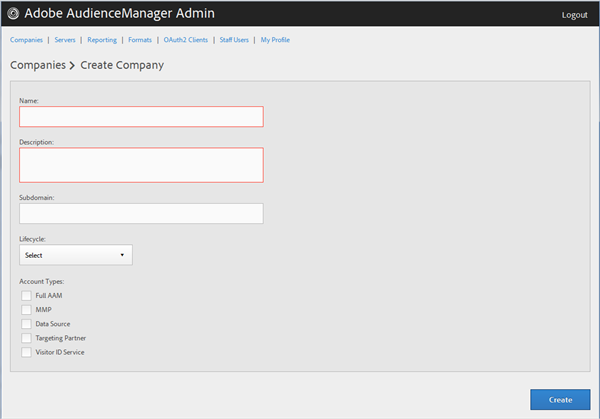
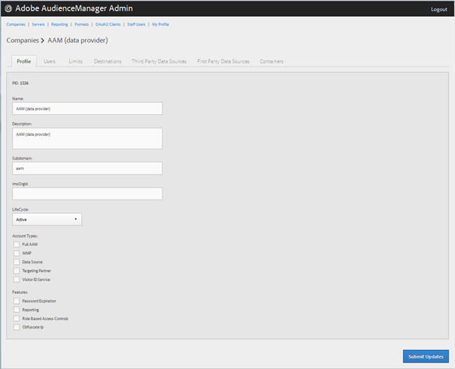
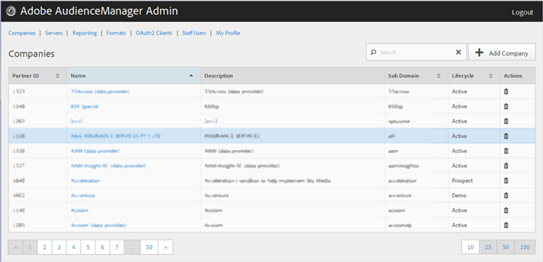

# Erstellen eines Firmenprofils {#create-a-company-profile}

Verwenden Sie die [!UICONTROL Companies] Seite im Audience Manager Admin Tool, um eine neue Firma zu erstellen.

<!-- t_create_company.xml -->

>[!NOTE]
>
>Sie müssen die **[!UICONTROL DEXADMIN]** Rolle haben, um neue Firmen zu erstellen.

1. Klicken **[!UICONTROL Companies]** > **[!UICONTROL Add Company]**.
1. Füllen Sie die Felder aus:

   * **[!UICONTROL Name]**: (Erforderlich) Geben Sie den Namen der Firma an.
   * **[!UICONTROL Description]**: (Erforderlich) Geben Sie beschreibende Informationen über die Firma ein, z. B. die Branche oder den vollständigen Namen.
   * **[!UICONTROL Subdomain]**: (Erforderlich) Geben Sie die Subdomäne der Firma an. Der von Ihnen eingegebene Text wird als Subdomäne des Ereignis-Aufrufs angezeigt. Das kann man nicht ändern. Es muss sich um eine Zeichenfolge mit [!DNL URL]gültigen Zeichen handeln.

      Wenn Ihre Firma beispielsweise benannt wurde [!DNL AcmeCorp], wäre die Subdomäne [!DNL acmecorp].

      Audience Manager verwendet die Subdomäne für [!UICONTROL Data Collection Server]([!UICONTROL DCS]). Im vorherigen Beispiel, wenn Ihre Firma voll [!DNL URL] in [!UICONTROL DCS] wäre [!DNL acmecorp.demdex.net].

   * **[!UICONTROL Lifecyle]**: Geben Sie die gewünschte Phase für die Firma an:
      * **[!UICONTROL Active]**: Geben Sie an, dass die Firma ein aktiver Audience Manager-Client sein soll. Ein [!UICONTROL Active] Konto bedeutet einen zahlenden Kunden, nicht nur für die Beratung, sondern für den Audience Manager SKU.
      * **[!UICONTROL Demo]**: Geben Sie an, dass die Firma nur zu Demozwecken verwendet werden soll. Berichte-Daten werden automatisch gefälscht.
      * **[!UICONTROL Prospect]**: Geben Sie an, dass es sich bei der Firma um einen potenziellen Audience Manager-Client handelt, z. B. um eine kostenlose Firma [!DNL POC] oder eine Kontoeinrichtung für eine Verkaufsdemo.
      * **[!UICONTROL Test]**: Geben Sie an, dass die Firma nur zu internen Testzwecken verwendet werden soll.
   * **[!UICONTROL Account Types]**: Geben Sie den vollständigen Satz von Kontotypen für diese Firma an. Kein Kontotyp schließt sich gegenseitig mit anderen Typen aus.
      * **[!UICONTROL Full AAM]**: Geben Sie an, dass die Firma über ein Vollbenutzerkonto verfügt und die Benutzer Zugriff auf den Adobe Audience Manager haben.
      * **[!UICONTROL MMP]**: Geben Sie an, dass die Firma für die Verwendung der [!UICONTROL Master Marketing Profile] ([!UICONTROL MMP])-Funktionen aktiviert wurde. Die [!UICONTROL MMP] ermöglicht die Freigabe von Audiencen im gesamten Experience Cloud mithilfe eines [!UICONTROL Experience Cloud ID] ([!DNL MCID]), das jedem Besucher zugewiesen und dann von Audience Manager verwendet wird. Wenn Sie diesen Kontotyp auswählen, [!UICONTROL Experience Cloud ID Service] wird auch die Option automatisch ausgewählt.

         Weitere Informationen finden Sie unter [Audiencen-Services - Übergeordnet Marketing-Profil](https://marketing.adobe.com/resources/help/en_US/mcloud/audience_library.html).
   * **[!UICONTROL Data Source]**: Geben Sie an, dass die Firma ein Drittanbieter für Daten in Audience Manager ist.
   * **[!UICONTROL Targeting Partner]**: Geben Sie an, dass die Firma als Targeting-Plattform für Audience Manager fungiert.
   * **[!UICONTROL Visitor ID Service]**: Geben Sie an, dass die Firma für die Verwendung der [!UICONTROL Experience Cloud Visitor ID Service]Variable aktiviert wurde.

      Der [!UICONTROL Experience Cloud Visitor ID Service] stellt eine universelle Besucher-ID für alle Experience Cloud-Lösungen bereit. For more information, see the [Experience Cloud Visitor ID Service user guide](https://marketing.adobe.com/resources/help/en_US/mcvid/mcvid-overview.html).

   * **[!UICONTROL Agency]**: Geben Sie an, dass die Firma über ein [!UICONTROL Agency] Konto verfügt.

1. Klicken **[!UICONTROL Create]**. Fahren Sie mit den Anweisungen unter Firma [bearbeiten Profil](../companies/admin-manage-company-profiles.md#edit-company-profile)fort.

   

## Bearbeiten von Firmenprofilen {#edit-company-profile}

Bearbeiten Sie das Profil einer Firma, einschließlich Name, Beschreibung, Subdomäne, Lebenszyklus usw.

<!-- t_edit_company_profile.xml -->

1. Klicken Sie auf **[!UICONTROL Companies]**, suchen Sie die gewünschte Firma und klicken Sie darauf, um die zugehörige [!UICONTROL Profile] Seite anzuzeigen.

   Verwenden Sie das [!UICONTROL Search] Feld oder die Paginierungssteuerelemente am unteren Rand der Liste, um die gewünschte Firma zu finden. Sie können jede Spalte in auf- oder absteigender Reihenfolge sortieren, indem Sie auf die Kopfzeile der gewünschten Spalte klicken.

   

1. Bearbeiten Sie die Felder je nach Bedarf:

   * **[!UICONTROL Name]**: Bearbeiten Sie den Namen der Firma. Dies ist ein erforderliches Feld.
   * **[!UICONTROL Description]**: Bearbeiten Sie die Beschreibung der Firma. Dies ist ein erforderliches Feld.
   * **[!UICONTROL Subdomain]**: (Erforderlich) Geben Sie die Subdomäne der Firma an. Der von Ihnen eingegebene Text wird als Subdomäne des Ereignis-Aufrufs angezeigt. Das kann man nicht ändern. Es muss sich um eine Zeichenfolge mit [!DNL URL]gültigen Zeichen handeln.

      Wenn Ihre Firma beispielsweise benannt wurde [!DNL AcmeCorp], wäre die Subdomäne [!DNL acmecorp].

      Audience Manager verwendet die Subdomäne für die [!UICONTROL Data Collection Server] ([!UICONTROL DCS]). Im vorherigen Beispiel, wenn Ihre Firma voll [!DNL URL] in [!UICONTROL DCS] wäre [!DNL acmecorp.demdex.net].

   * **[!UICONTROL imsOrgld]**: ([!UICONTROL Identity Management System Organization ID]) Mit dieser ID können Sie Ihre Firma mit der Adobe Experience Cloud verbinden.
   * **[!UICONTROL Lifecyle]**: Geben Sie die gewünschte Phase für die Firma an:
      * **[!UICONTROL Active]**: Geben Sie an, dass die Firma ein aktiver Audience Manager-Client sein soll. Ein Aktives Konto bedeutet einen zahlenden Kunden, nicht nur für Beratung, sondern für den Audience Manager-SKU.
      * **[!UICONTROL Demo]**: Geben Sie an, dass die Firma nur zu Demozwecken verwendet werden soll. Berichte-Daten werden automatisch gefälscht.
      * **[!UICONTROL Prospect]**: Geben Sie an, dass es sich bei der Firma um einen potenziellen Audience Manager-Client handelt, z. B. um eine kostenlose Firma [!DNL POC] oder eine Kontoeinrichtung für eine Verkaufsdemo.
      * **[!UICONTROL Test]**: Geben Sie an, dass die Firma nur zu internen Testzwecken verwendet werden soll.
   * **[!UICONTROL Account Types]**: Geben Sie den vollständigen Satz von Kontotypen für diese Firma an. Kein Kontotyp schließt sich gegenseitig mit anderen Typen aus.
      * **[!UICONTROL Full AAM]**: Geben Sie an, dass die Firma über ein Vollbenutzerkonto verfügt und die Benutzer Zugriff auf den Adobe Audience Manager haben.
      * **[!UICONTROL MMP]**: Geben Sie an, dass die Firma für die Verwendung der Übergeordnet Marketing Profil ([!UICONTROL MMP])-Funktionen aktiviert wurde.

         Wenn Sie diesen Kontotyp auswählen, **[!UICONTROL Visitor ID Service]** wird auch automatisch ausgewählt.
Weitere Informationen finden Sie unter [Audiencen-Services - Übergeordnet Marketing-Profil](https://marketing.adobe.com/resources/help/en_US/mcloud/audience_library.html).
   * **[!UICONTROL Data Source]**: Geben Sie an, dass die Firma ein Drittanbieter für Daten in Audience Manager ist.
   * **[!UICONTROL Targeting Partner]**: Geben Sie an, dass die Firma als Targeting-Plattform für Audience Manager fungiert.
   * **[!UICONTROL Visitor ID Service]**: Geben Sie an, dass die Firma für die Verwendung des Experience Cloud-Besucher-ID-Diensts aktiviert wurde.

      Der Experience Cloud-Besucher-ID-Dienst stellt eine universale Besucher-ID für alle Experience Cloud-Lösungen bereit. For more information, see the [Experience Cloud Visitor ID Service user guide](https://microsite.omniture.com/t2/help/en_US/mcvid/mcvid_service.html).

   * **[!UICONTROL Agency]**: Geben Sie an, dass die Firma über ein Agenturkonto verfügt.
   * **[!UICONTROL Features]**: Wählen Sie die gewünschten Optionen aus:
      * **[!UICONTROL Password Expiration]**: Legt fest, dass alle Benutzerkennwörter innerhalb dieser Firma nach 90 Tagen ablaufen, um die Sicherheit der Audience Manager zu erhöhen.
      * **[!UICONTROL Reporting]**: Aktiviert Audience Manager Berichte für diese Firma.
      * **[!UICONTROL Role Based Access Controls]**: Aktivieren Sie rollenbasierte Zugriffskontrollen für diese Firma. Mithilfe rollenbasierter Zugriffskontrollen können Sie Benutzergruppen mit unterschiedlichen Zugriffsberechtigungen erstellen. Einzelne Benutzer innerhalb dieser Gruppen können dann nur auf bestimmte Funktionen in Audience Manager zugreifen.

1. Klicken **[!UICONTROL Submit Updates]**.

## Löschen eines Firmen-Profils {#delete-company-profile}

Verwenden Sie die [!UICONTROL Companies] Seite im Audience Manager- [!UICONTROL Admin] Tool, um eine vorhandene Firma zu löschen.

<!-- t_delete_company.xml -->

>[!NOTE]
>
>Sie müssen die [!UICONTROL DEXADMIN] Rolle haben, um vorhandene Firmen zu löschen.

1. Klicken Sie zum Löschen einer vorhandenen Firma auf **[!UICONTROL Companies]**.

   

1. Klicken Sie  in die **[!UICONTROL Actions]** Spalte der gewünschten Firma.
1. Klicken Sie auf **[!UICONTROL OK]**, um den Löschvorgang zu bestätigen.
