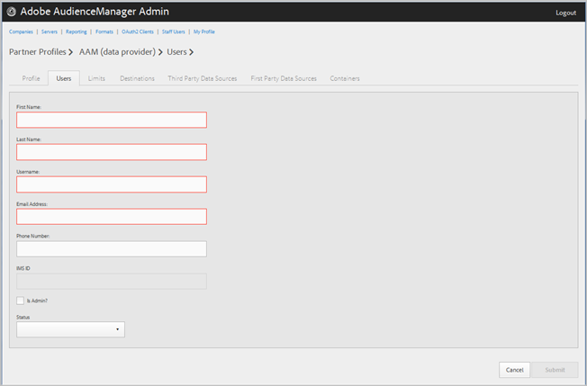

# Verwalten von Firmenbenutzern {#manage-company-users}

Erstellen Sie neue Audience Manager-Benutzer oder bearbeiten und löschen Sie vorhandene Benutzer.

<!-- t_manage_company_users.xml -->

1. Klicken Sie auf **[!UICONTROL Companies]**, suchen Sie die gewünschte Firma und klicken Sie darauf, um die zugehörige [!UICONTROL Profile] Seite anzuzeigen.

   Verwenden Sie das [!UICONTROL Search] Feld oder die Paginierungssteuerelemente am unteren Rand der Liste, um die gewünschte Firma zu finden. Sie können jede Spalte in auf- oder absteigender Reihenfolge sortieren, indem Sie auf die Kopfzeile der gewünschten Spalte klicken.
1. Click the **[!UICONTROL Users]** tab.
1. Um einen neuen Benutzer zu erstellen, klicken Sie auf **[!UICONTROL Create a New User]**. Um einen vorhandenen Benutzer zu bearbeiten, suchen Sie den gewünschten Benutzer und klicken Sie auf die **[!UICONTROL Username]** Spalte.

   

1. Füllen Sie die Felder aus:

   * **[!UICONTROL First Name]**: (Erforderlich) Geben Sie den Vornamen des Benutzers an.
   * **[!UICONTROL Last Name]**: (Erforderlich) Geben Sie den Nachnamen des Benutzers an.
   * **[!UICONTROL Username]**: (Erforderlich) Geben Sie den Benutzernamen des Audience Managers an. Benutzernamen müssen eindeutig sein.
   * **[!UICONTROL Email Address]**: (Erforderlich) Geben Sie die E-Mail-Adresse des Benutzers an.
   * **[!UICONTROL Phone Number]**: Geben Sie die Telefonnummer des Benutzers an.
   * **[!UICONTROL IMS ID]**: Der Benutzer [!UICONTROL Identity Management System ID]. Mit dieser ID kann der Benutzer eine Verknüpfung zu Adobe-Lösungen mit der Adobe Experience Cloud herstellen.
   * **[!UICONTROL Is Admin]**: Machen Sie diesen Audience Manager zu einem Administrator-Benutzer. Ein Administrator hat alle Benutzerrollen für diesen Audience Manager.
   * **[!UICONTROL Status]**: Beim Erstellen eines neuen Benutzers wird dieses Feld zunächst so lange angezeigt, **[!UICONTROL Pending]** bis sich der Benutzer anmeldet und das temporäre Kennwort zurücksetzt. Wenn Sie einen vorhandenen Benutzer bearbeiten, können Sie einen der folgenden Status auswählen:
      * **[!UICONTROL Active]**: Gibt an, dass dieser Audience Manager aktiv ist.
      * **[!UICONTROL Deactivated]**: Gibt an, dass dieser Audience Manager deaktiviert ist.
      * **[!UICONTROL Expired]**: Gibt an, dass dieser Benutzer ein abgelaufener Benutzer ist.
      * **[!UICONTROL Locked Out]**: Gibt an, dass dieser Benutzer ein ausgeschlossener Benutzer ist.

1. Klicken **[!UICONTROL Submit]**.

## Einen Benutzer löschen {#delete-user}

So löschen Sie einen Benutzer:

1. Klicken Sie auf **[!UICONTROL Companies]**, suchen Sie die gewünschte Firma und klicken Sie auf die **[!UICONTROL Users]** Registerkarte.
1. Klicken Sie  in die **[!UICONTROL Actions]** Spalte des gewünschten Benutzers.
1. Klicken Sie auf **[!UICONTROL OK]**, um den Löschvorgang zu bestätigen.