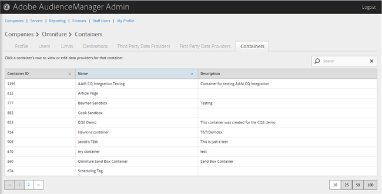
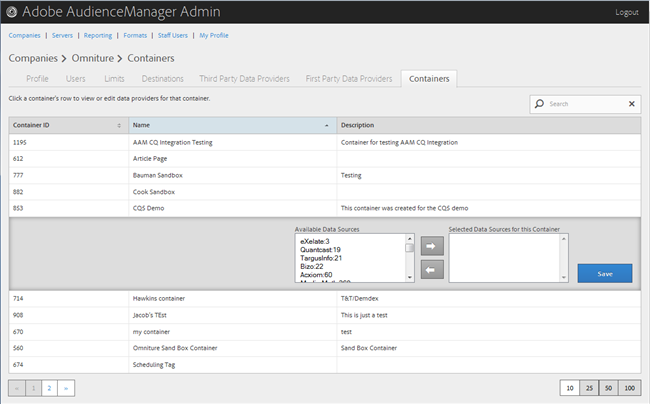

# Verwalten von Containern {#manage-containers}

Ansicht oder Bearbeitung von Datenanbietern für Container.

<!-- t_containers.xml -->

>[!NOTE]
>
>Standardmäßig werden Firmen mit einem Container erstellt. Sie können weitere Container für eine Firma in der Benutzeroberfläche in **[!UICONTROL Tools > Tags]** erstellen.

1. Klicken Sie auf **[!UICONTROL Companies]**, suchen Sie die gewünschte Firma und klicken Sie darauf, um deren [!UICONTROL Profile]-Seite anzuzeigen.

   Verwenden Sie das Feld [!UICONTROL Search] oder die Paginierungssteuerelemente am unteren Rand der Liste, um die gewünschte Firma zu finden. Sie können jede Spalte in auf- oder absteigender Reihenfolge sortieren, indem Sie auf die Kopfzeile der gewünschten Spalte klicken.

1. Klicken Sie auf die Registerkarte **[!UICONTROL Containers]**.

   

1. Klicken Sie auf die Zeile eines Containers, um die Datenanbieter für diesen Container Ansicht oder zu bearbeiten.

   

1. Verschieben Sie die Datenquellen aus den Listen **[!UICONTROL Available Data Sources]** und **[!UICONTROL Selected Data Sources for This Container]**, indem Sie die gewünschten Datenquellen auswählen und dann nach Bedarf auf den Rechts- oder Linkspfeil klicken.

   Sie können diese Aufgabe auch über die Seite [Datenanbieter von Drittanbietern](../companies/admin-third-party-providers.md#task_E942DD674D794BA6B8EFD52FD866E689)durchführen.

1. Klicken Sie auf **[!UICONTROL Save]**, wenn Sie Änderungen vorgenommen haben.

>[!MORELIKETHIS]
>
>* [ID-Synchronisierung mit Media Optimizer](../companies/admin-amo-sync.md#concept_2B5537233DAA4860B3503B344F937D83)

