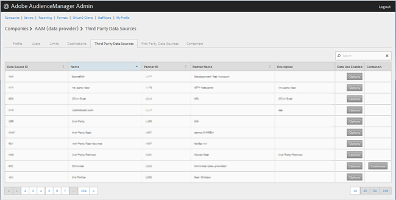
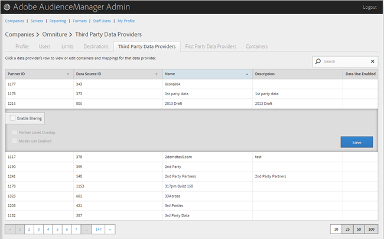

# Drittanbieter für Daten verwalten {#manage-third-party-data-providers}

Anzeigen oder Bearbeiten von Behältern und Zuordnungen für Drittanbieter von Daten. Sie können auch die Freigabe für verschiedene Datenanbieter aktivieren.

1. Klicken Sie auf **[!UICONTROL Companies]**, suchen Sie das gewünschte Unternehmen und klicken Sie darauf, um die zugehörige [!UICONTROL Profile] Seite anzuzeigen.

   Verwenden Sie das [!UICONTROL Search] Feld oder die Paginierungssteuerelemente unten in der Liste, um das gewünschte Unternehmen zu finden. Sie können jede Spalte in auf- oder absteigender Reihenfolge sortieren, indem Sie auf die Kopfzeile der gewünschten Spalte klicken.
1. Click the **[!UICONTROL Third Party Data Providers]** tab.

   

1. Klicken Sie auf die Zeile eines Datenanbieters, um Behälter und Zuordnungen für diesen Datenanbieter anzuzeigen oder zu bearbeiten.

   

1. Wählen Sie **[!UICONTROL Enable Sharing]** die folgenden Optionen aus:

   * **Überschneidung auf Partnerebene:**
   * **** Modellverwendung aktiviert: Ermöglicht diesem Unternehmen, diesen Datenanbieter beim Erstellen algorithmischer Modelle zu verwenden.
   Wenn Sie die Freigabe aktivieren, erhalten Sie Zugriff auf Eigenschaften von diesem Datenanbieter.

1. (Bedingt) Wenn der Container für diesen Anbieter aktiviert ist, können Sie Behälter für diesen Datenanbieter auswählen, indem Sie die gewünschten Behälter aus der verfügbaren Liste in die ausgewählte Liste verschieben.

   Sie können diese Aufgabe auch auf der Seite [Behälter](../companies/admin-manage-containers.md#task_61DB5CEECC5049DD8D059C642AC3F967) ausführen.
1. Klicken Sie auf **[!UICONTROL Save]** , wenn Sie Änderungen vorgenommen haben.