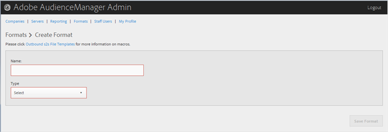

# Ein Format erstellen oder bearbeiten {#create-or-edit-a-format}

Verwenden Sie die [!UICONTROL Formats] Seite im Audience Manager-Verwaltungswerkzeug, um ein neues Format zu erstellen oder ein vorhandenes Format zu bearbeiten.

<!-- t_create_format.xml -->

>[!TIP]
>
>Wenn Sie ein Format für Ihre verstrichenen Daten auswählen, empfiehlt es sich, nach Möglichkeit ein vorhandenes Format erneut zu verwenden. Die Verwendung eines bereits bewährten Formats gewährleistet, dass Ihre ausgehenden Daten erfolgreich generiert werden. Um genau zu sehen, wie ein vorhandenes Format formatiert ist, klicken Sie in der Menüleiste auf die [!UICONTROL Formats] Option und suchen Sie entweder nach dem Namen oder nach der ID-Nummer nach Ihrem Format. Fehlerhafte Formate oder Makros, die in Formaten verwendet werden, liefern falsch formatierte Ausgabe oder verhindern, dass Informationen vollständig ausgegeben werden.

1. Klicken Sie **[!UICONTROL Formats]** auf &gt; **[!UICONTROL Add Format]**, um ein neues Format zu erstellen. To edit an existing format, click the desired format in the **[!UICONTROL Name]** column.

   

1. Füllen Sie die Felder aus:
   * **Name:** (Erforderlich) Geben Sie einen beschreibenden Namen für das Format ein.
   * **Typ:** (Erforderlich) Wählen Sie das gewünschte Format aus:
      * **[!UICONTROL File]**: Sendet Daten über [!DNL FTP] Dateien.
      * **[!UICONTROL HTTP]**: Schließt Daten in einem [!DNL JSON] Wrapper ein.

1. (Bedingt) Wenn Sie die **[!UICONTROL File]** Felder auswählen, füllen Sie die Felder aus:

   >[!NOTE]
   >
   >Eine Liste der verfügbaren Makros finden Sie unter [Dateiformat-Makros](../formats/file-formats.md#concept_A867101505074418A58DE325949E5089) und [HTTP-Format-Makros](../formats/web-formats.md#reference_C392124A5F3F42E49F8AADDBA601ADFE).

   * **[!UICONTROL File Name]:** Geben Sie den Dateinamen für die Datenübertragungsdatei an.
   * **Kopfzeile:** Geben Sie den Text an, der in der ersten Zeile der Datenübertragungsdatei angezeigt wird.
   * **[!UICONTROL Data Row]:** Geben Sie den Text an, der in den einzelnen Zeilen der Datei angezeigt wird.
   * **[!UICONTROL Maximum File Size (In MB)]:** Geben Sie die maximale Dateigröße für Datenübertragungsdateien an. Komprimierte Dateien müssen kleiner als 100 MB sein. Die Größe nicht komprimierter Dateien ist unbegrenzt.
   * **[!UICONTROL Compression]:** Wählen Sie den gewünschten Komprimierungstyp aus: gz oder zip für Ihre Datendateien. Für die Bereitstellung [!UICONTROL AWS S3]müssen Sie.gz oder nicht komprimierte Dateien verwenden.
   * **[!UICONTROL .info Receipt]:** Gibt an, dass eine Transfer-Control ([!DNL .info])-Datei erzeugt wird. Die [!DNL .info] Datei enthält Metadateninformationen zu Dateiübertragungen, damit Partner überprüfen können, ob die Datei von Audience Manager richtig verarbeitet wurde. Weitere Informationen finden Sie unter [Übertragungssteuerungsdateien für Protokolldateiübertragungen](https://marketing.adobe.com/resources/help/en_US/aam/c_s2s_add_transfer_control_files.html).
   * **[!UICONTROL MD5 Checksum Receipt]:** Gibt an, dass ein [!DNL MD5] Prüfsummenbeleg erzeugt wird. Der [!DNL MD5] Prüfsummenbeleg, damit Partner überprüfen können, ob Audience Manager die vollständige Übertragung richtig verarbeitet hat.

1. (Bedingt) Wenn Sie die **[!UICONTROL HTTP]** Felder auswählen, füllen Sie die Felder aus:

   * **[!UICONTROL Method]:** Wählen Sie die [!DNL API] Methode aus, die Sie für den Übertragungsprozess verwenden möchten:
      * **[!UICONTROL POST]:** Wenn Sie auswählen [!DNL POST], wählen Sie den Inhaltstyp ([!DNL XML] oder [!DNL JSON]) aus und geben Sie dann den Anforderungstext an.
      * **[!UICONTROL GET]:** Wenn Sie auswählen [!DNL GET], geben Sie die Abfrageparameter an.

1. Klicken **[!UICONTROL Create]** Sie auf, wenn Sie ein neues Format erstellen, oder klicken **[!UICONTROL Save Updates]** Sie auf, wenn Sie ein vorhandenes Format bearbeiten.

## Ein Format löschen {#delete-format}

1. Klicken Sie auf **[!UICONTROL Formats]**.
2. Klicken  Sie in die **[!UICONTROL Actions]** Spalte des gewünschten Formats.
3. Klicken Sie auf **[!UICONTROL OK], um den Löschvorgang zu bestätigen.**
