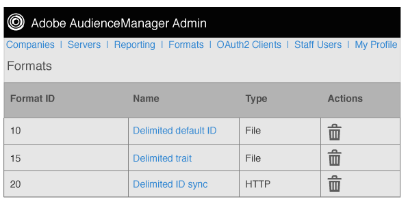

# Übersicht über Formate {#formats-overview}

Ein Format ist eine gespeicherte Vorlage (oder Datei), die mithilfe von Makros den Inhalt der an ein Ziel gesendeten Daten organisiert. Zu den Formattypen gehören [!DNL HTTP] Formate und Dateiformate. [!DNL HTTP] Formate senden Daten in einem [!DNL JSON] Objekt mit einer [!DNL POST] oder [!DNL GET] -Methode. Dateiformate senden Daten in einer Datei nach [!DNL FTP]. Mit den in den einzelnen Formaten verwendeten Makros können Sie Dateinamen festlegen, Dateiüberschriften definieren und den Inhalt einer Datendatei organisieren. In Admin [!DNL UI]können Sie Formate erstellen, speichern und wiederverwenden, wenn Sie Ziele für Kunden einrichten.

